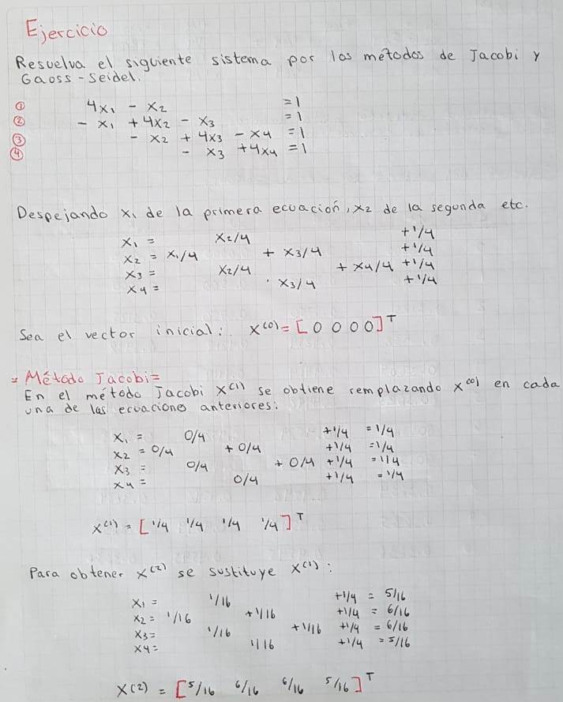
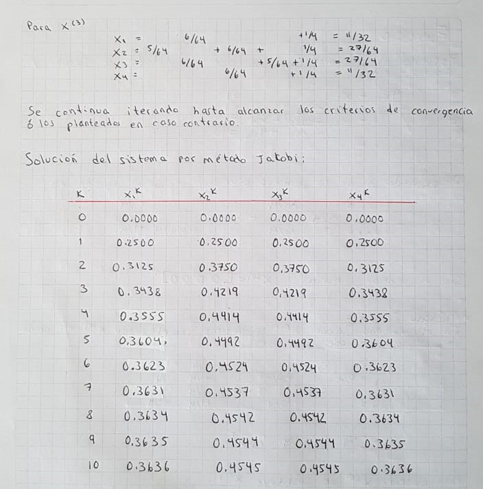
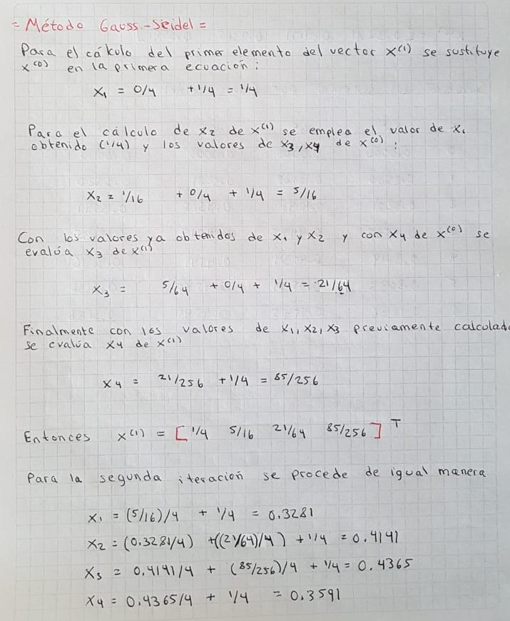
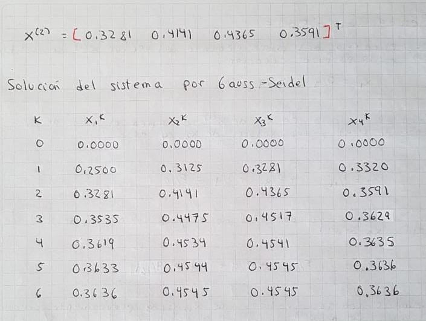

```{r setup, include=FALSE}
#knitr::opts_chunk$set(echo = TRUE)
knitr::opts_chunk$set(
    comment = "#>",
    collapse = TRUE, error=FALSE
)
```

## Introducción 
### Métodos Iterativos.

Al resolver un sistema de ecuaciones lineales por eliminación, la memoria de máquina requerida es proporcional al cuadrado del orden de A, y el trabajo computacional es proporcional al cubo del orden de la matriz de coeficiente A. Debido a esto, la solución de sistemas grandes (n ≥ 50), con matrices coeficientes densas (pocos ceros como elementos) se vuelve costoso y difícil en una computadora con los métodos de eliminación, ya que se requiere amplia memoria; además, como el número de operaciones que se debe ejecutar es muy grande, se pueden producir errores de redondeo también muy grandes, resultando en ciertos aspectos más ventajosos los métods iterativos.

### Métodos de Gauss-Seidel y Jacobi

Los métodos iterativos más sencillos y conocidos son una generalización del método de punto fijo. Se puede aplicar la misma técnica a fin de elaborar métodos para la solución de $A x = b$ de la siguiente manera:

* Se parte de $A x = b$ para obtener la ecuación **(1)**
    $$A x - b= 0   $$ 
ecuación vectorial correspondiente a $f(x) = 0$ .

* Se busca ahora una matriz **B** y un vector **c** de manera que la ecuación vectorial **(2)**
  $$x =  Bx + c$$ 
  sea sólo un arreglo de la ecuación (1) es decir, de manera que la solución de una sea también la solución de la otra. La
  ecuación (2) correspondería a $x=g(x)$. 
  
* Acontinuación se propone un vector inicial $x^{(0)}$ como primera aproximación al vector solución x. Luego, se calcula con la ecuación **(2)** la sucesión vectorial  $x^{(1)}$ $x^{(2)}$ , .... , de la siguiente manera

$$x^{(k+1)} = Bx^{(k)}+c, k = 0,1,2,...$$

donde **(3)**:

$$x^{(k)} = [x_1^{(k)} x_2^{(k)}...x_n^{(k)}]^T$$


* Para que la sucesión $x^{(0)}$, $x^{(1)}$,..., $x^{(n)}$,...,  converja al vector solución x es necesario que eventualmente $x_j^{(m)}$ , 1 ≤ j ≤ n (los componentes del vector $x^{(m)}$ ), se aproximen tanto a $x_j$ 1 ≤ j ≤ n (los componentes correspondientes a x), que todas las diferencias $|x_j^{(m)} - x_j| $ , 1 ≤ j ≤ n sean menores que un valor pequeño fijado previamente, y que se conserven menores para todos los vectores siguientes de la iteración; es decir 


$$\lim_{m -> \inf} = x_j^{m} = x_j ....1 ≤ j ≤ n $$

La forma  como se llega a la ecuación **(2)** define el algoritmo y su convergencia. Dado el sistema $A x = b$ , la manera más sencilla es despejar $x_1$ de la primera ecuación, $x_2$ de la segunda etc.Para ello, es necesario que todos los elementos de la diagonal principal de A, sean distintos de 0. Para ver esto en detalle considérese el sistema general de tres ecuaciones (puede extenderse a cualquier número de ecuaciones) sea entonces :

$$a_{1,1} x_1 + a_{1,2} x_2 + a_{1,3} x_3 = b_1$$
$$a_{2,1} x_1 + a_{2,2} x_2 + a_{2,3} x_3 = b_2$$
$$a_{3,1} x_1 + a_{3,2} x_2 + a_{3,3} x_3 = b_3$$

con $a_{11}$ , $a_{22}$ y $a_{33}$  distintos de cero.

* Se despeja  $x_1$ de la primera ecuación, $x_2$ de la segunda y $x_3$ de la tercera con lo que queda: 


que en notación matricial queda **(4)**:


y ésta es la ecuación desarrollada con 


Una vez que se tiene la forma **(4)** , se propone un vector inicial $x^{(0)}$ que puede ser $x^{(0)}=0$  o algún otro que sea aproximado al vector solución x. Para iterar existen dos variantes

### Iteración de Jacobi (método de desplazamientos simultáneos)

Sí


es el vector aproximación a la solución x después de k iteraciones, entonces se tiene para la siguente aproximación 


O bien, para un sistema de n ecuaciones con n incógnitas y usando notación más compacta y de mayor utilidad en programación, se tiene:


### Iteración de Gauss-Seidel (método de desplazamientos sucesivos)

En este método los valores que se van calculando en la (k+1)-ésima iteración se emplean para calcular los valores faltantes de esa misma iteración; es decir, con $x^{(k)}$ se calcula $x^{(k+1)}$ de acuerdo con:


Obien para un sistema de n ecuaciones:


### Criterio de Convergencia

Si la sucesión converge a x, cabe esperar que los elementos de $x^{(k)}$  se vayan acercando a los elementos correspondientes de x , es decir  $x_1^{(k)}$ a $x_1$, $x_2^{(k)}$ a $x_2$,etc.

Se debe detener el proceso iterativo cuando:

a) Los valores absolutos $|x_1^{(k+1)}-x_1^{(k)}|$ , $|x_2^{(k+1)}- x_2^{(k)}|$ , etc., sean todos menores de un número pequeño $\epsilon$ en cuyo valor será dado por el programador, o bien 

b) si el número de iteraciones ha excedido un máximo predeterminado MAXIT. 

c) Detener el proceso una vez que $|x^{(k+1)}-x^{(k)}| < \epsilon$

Al elaborar un programa de cómputo para resolver sistemas de ecuaciones lineales, generalmente se utilizan los criterios a), b) y c) o la combinación de a) y b) o la de b) y c).

Aunque hay ejemplos en los que Jacobi converge y Gauss-Seidel diverge y viceversa, en general puede esperarse convergencia más rápida por Gauss-Seidel, o una manifestación más rápida de divergencia. Esto se debe al hecho de ir usando los valores más recientes de $x^{(k+1)}$ que permitirán acercarse o alejarse más rápidamente de la solución.

### Rearreglo de Ecuaciones

Si el proceso iterativo diverge, un rearreglo de las ecuaciones puede originar convergencia. Esta sugerencia presenta para un sistema de n ecuaciones , n! distintas formas de rearreglar dicho sistema. A fin de simplificar este procedimiento se utilizará el siguiente teorema

<div class="box">
**Teorema** Los procesos de Jaobi y Gauss-Seidel convergirán si en la matríz coeficientes cada elemento de la diagonal principal es mayor (en valor absoluto ) que la suma de los valores absolutos de todos los demás elementos de la misma fila o columna (matriz diagonal dominante). Es decir se asegura la convergencia si:

$$|a_{i,i}| > \sum_{j=1}^{n}|a_{i,j}| .....1 ≤ j ≤ n$$
$$|a_{i,i}| > \sum_{j=1}^{n}|a_{j,i}| .....1 ≤ j ≤ n$$

</div>

Este terorema  no será de mucha utilidad si se toma  al pie de la letra ya que contados sistemas de ecuaciones linealesposeen matrices coeficiente diagonalmente dominantes, sin embargo si se arreglan las ecuaciones para tener el sistema lo más cercano posible a las condiciones del teorema, algún beneficio se puede obtener.

## Ejemplos

**Ejemplo 1**













**Ejemplo2**

Resolver el siguiente sistema con el método de Gauss-Seidel y con $\epsilon = 10^{-2}$ aplicado a $|x^{(k+1)}-x^{(k)}|$


$$- x_1 + 3 x_2 + 5 x_3 + 2 x_4 = 10$$
$$ x_1 + 9 x_2 + 8 x_3 + 4 x_4 = 15$$
$$  x_2 +  x_4 = 2$$
$$2 x_1 + x_2 + x_3 - x_4 = -3$$
Al resolver x1 de la primera ecuación, x2 de la seguna , x3 de la cuarta y x4 de la tercera

$$x_1 =  3 x_2 + 5 x_3 + 2 x_4 -10$$
$$ x_2 =   -x_1/9  - (8/9) x_3 - (4/9) x_4 + 15/9$$

$$ x_3 =  -2 x_1 - x_2 + x_4 -3$$
$$  x_4=   -x_2 + 2$$
Con el vector cero como el vector inicial se tiene la siguiente sucesión en las iteraciones

k        | $x_1^{(k)}$       | $x_2^{(k)}$  | $x_3^{(k)}$  | $x_4^{(k)}$ | $|x^{(k+1)} - x^{(k)}|$  |
---------|-------------------|--------------|--------------|-------------|--------------------------|
0        |    0.000          | 0.000        |  0.000       |  0.000      |                          |
1        |   -10.00          | 2.7778       | 14.222       |  -0.7778    |    17.62                 |
2        |    67.8889        | -18.172      | -121.2       |  20.17      |    159.0                 |
3        |   -631.1          | 170.7        | 1108.0       |  -168.71    |    1439.05               |

Como podemos observar el proceso iterativo diverge por lo que un rordenamiento de las ecuaciones puede originar convergencia. Como veremos más adelante usando la implementación en C


## Implementación Algoritmo

Un pseudo código de la implementación sería el siguiente:

Para encontrar la solución aproximada del sistema de ecuaciones A x = b proporcionar los

**Datos**:  El número de ecuaciones **N**, la matriz coeficiente **A**, el vector de términos independientes **b**, el vector inicial **x0**, el número máximo de iteraciones MAXIT, el valor de $\epsilon$ y definir si se usará Jacobi o Gauss-Seidel (en esta implementación se usará M = 0 para Jacobi)

**PASOS**

* PASO 1: Arreglar la matriz aumentada de modo que la matriz coeficiente quede lo más cercana posible a la diagonal dominante
* PASO 2: Hacer k=1
* PASO 3: Mientras K ≤  MAXIT, repetir los pasos 4 a 17
    + PASO 4: Si M = 0 ir al paso 5 . De otro modo Hacer * x= x0.
    + PASO 5: Hacer I = 1.
    + PASO 6: Mientras I ≤ N, repetir los pasos 7 a 14.
        - PASO 7: Hacer SUMA = 0
        - PASO 8: Hacer J=1
        - PASO 9: Mientras J ≤ N, repetir los pasos 10 a 12
            + PASO 10: Si J = I ir al paso 12
            + PASO 11: Hacer SUMA = SUMA + A(I,J)*x0(J)
            + PASO 12: Hacer J = J+1
        - PASO 13: Si M=0 hacer x(I) = (b(I)-SUMA)/(A(I,I))
             De otro modo hacer x0(I)=(b(I)-SUMA)/(A(I,I))
        - PASO 14: Hacer I = I + 1
    + PASO 15: Si |x-x0| ≤ $\epsilon$ ir al paso 19. De otro modo continuar
    + PASO 16: Si M=0, hacer x0 = x
    + PASO 17: Hacer k= k+1
* PASO 18: IMPRIMIR mensaje "NO SE ALCANZÓ LA CONVERGENCIA", el vector x, MAXIT y el mensaje "ITERACIONES" y TERMINAR
* PASO 19: IMPRIMIR el mensaje "VECTOR SOLUCIÓN", x,K y el mensaje "ITERACIONES" y TERMINAR

El siguiente código es la implementación en C
```{rcpp}
/*

  Programa para resolver un sistema de ecuaciones lineales
  por los métodos de Jacobi y Gauss-Seidel

  Descripci¢n de variables :

  a    : Matriz de coeficientes del sistema.
  b    : Vector de términos independientes.
  x    : Vector soluci¢n del sistema.
  x0   : Vector de valores iniciales.
  n    : Número de ecuaciones.
  Eps  : Criterio de convergencia aplicado componente a
         componente de dos vectores consecutivos.
  iter : N£mero máximo de iteraciones.
  m    : 0 para Jacobi;  1 para Gauss-Seidel.

				    */

  #include <stdio.h>
  #include <curses.h>
  #include <stdlib.h> 
  #include <math.h>

  #define TRUE 1
  #define FALSE 0
  #define ITER 20

  double   x[10],x0[10],b[10];
  int      m,n,i,j,k,converge,respuesta;
  double   a[10][11],s,eps;

double main()
  {

     /* Lectura de n, a, b y x0. */

   system("cls");
   eps=1e-2;
   printf("Escriba criterio de convergencia (ej 1e-2) :\n");
   scanf("%lf",&eps);
   printf("Desea correr el programa con :\n");
   printf("1.- Datos del ejemplo 3\n");
   printf("2.- Otros datos\n");
   printf("Escriba 1 ó 2: ");
   scanf("%d",&respuesta);
   switch (respuesta)
   {
   case 2 :


     printf("   Número de ecuaciones ");  scanf("%d",&n);
     for(i=1; i<=n; i++)
        {
           printf(   "Fila %d\n",i);
           for(j=1; j<=n; j++)
              {
	     printf("A(%d,%d) = ",i,j);  scanf("%lf",&a[i][j]);
              }
           printf("b(%d) = ",i);  scanf("%lf",&b[i]);
        }
     for(i=1; i<=n; i++)
        {
           printf("x0(%d) = ",i);   scanf("%lf",&x0[i]);
        }
	printf("Valor de M (0 para Jacobi; 1 para Gauss-Seidel): ");
	scanf("%d",&m);
     break;

     /* Las siguientes instrucciones asignan los datos del ejercicio  */

     case 1:

     n=5;         m=1;          eps=1e-5;
     a[1][1]=98;  a[1][2]=9;    a[1][3]=2;  a[1][4]=1;   a[1][5]=0.5;
     a[2][1]=11;  a[2][2]=118;  a[2][3]=9;  a[2][4]=4;   a[2][5]=0.88;
     a[3][1]=27;  a[3][2]=27;   a[3][3]=85; a[3][4]=8;   a[3][5]=2;
     a[4][1]=1;   a[4][2]=3;    a[4][3]=17; a[4][4]=142; a[4][5]=25;
     a[5][1]=2;   a[5][2]=4;    a[5][3]=7;  a[5][4]=17;  a[5][5]=118;
     b[1]=0.11;   b[2]=0.2235;  b[3]=0.28;  b[4]=0.3;    b[5]=0.14;
     x0[1]=0;     x0[2]=0;      x0[3]=0;    x0[4]=0;     x0[5]=0;
     }

     /* Inicio del proceso iterativo */

     converge=FALSE;
     k=0;
     while(!converge &&  (k<ITER) )
        {
          if (m != 0)
	 for (i=1; i<=n; i++)
	    x[i]=x0[i];
           for(i=1; i<=n; i++)
               {
	      s=0;
	      for(j=1; j<=n; j++)
	         if((i-j)!=0) s=s+a[i][j]*x0[j];
	      if (m == 0)
	         x[i]=(b[i]-s)/a[i][i];
	      else
	         x0[i]=(b[i]-s)/a[i][i];
               }
	   k++;
        /* Aplicación del criterio de convergencia */

        for(i=1; i<=n; i++)
            {
	   if(fabs(x0[i]-x[i]) > eps) converge=FALSE;
	   else converge=TRUE;
	   if (m == 0)
	      x0[i]=x[i];

            }
        }
     if(converge)
        {
           printf("   DESPUES DE %d ITERACIONES, ",k);
           printf("   LA SOLUCION DEL SISTEMA ES : \n");   printf("\n");
           for(i=1; i<=n; i++)
	  if (m == 0)
	     printf("     x(%d) = %12.6f\n",i,x[i]);
	  else
	     printf("     x(%d) = %12.6f\n",i,x0[i]);
        }
        else

        {
           printf("   DESPUES DE %d ITERACIONES NO CONVERGE\n",k);
           printf("   ULTIMOS VALORES OBTENIDOS\n");   printf("\n");
           for(i=1; i<=n; i++)
	  printf("      x(%d) = %12.6f\n",i,x[i]);
        }
   getchar();
   }

```


Se compila el archivo en una terminal de Ubuntu


Posteriormente se prueba con los siguientes ejemplos:

### Ejemplos resueltos con la implementación

**Ejemplo 3**

Determine las concentraciones molares de una mezcla de cinco componentes en solución a partir de los siguientes datos espectrofotométricos


Long onda i | Abs. molar comp 1 | Abs.molar comp 2  | comp 3   | comp 4| comp 5      | Absorbencia total observada |
------------|-------------------|-------------------|----------|-------|-------------|-----------------------------|
1           |    98             | 9                 |  2       |  1    |    0.5      |   0.1100                    |
2           |    11             | 118               |  9       |  4    |    0.88     |   0.2235                    |
3           |    27             | 27                |  85      |  8    |    2        |   0.2800                    |
4           |    1              | 3                 |  17      |  142  |    25       |   0.3000                    |
5           |    2              | 4                 |  7       |  17   |    118      |   0.1400                    |

Asúmase que la longitud de la trayectoria óptica es unitaria y que el solvente no absorbe a estas longitudes de onda.

**Solución**

Al sustituir los valores de la tabla se obtiene:

$$98 C_1 + 9 C_2 + 2 C_3 +  C_4 + 0.5 C_5 = 0.1100$$
$$11 C_1 + 118 C_2 + 9 C_3 + 4 C_4 + 0.88 C_5 = 0.2235$$
$$27 C_1 + 27 C_2 + 85 C_3 + 8 C_4 + 2 C_5 = 0.2800$$

$$1 C_1 + 3 C_2 + 17 C_3 + 142 C_4 + 25 C_5 = 0.3000$$

$$2 C_1 + 4 C_2 + 7 C_3 + 17 C_4 + 118 C_5 = 0.1400$$

Un sistema de ecuaciones lineales con matriz coeficiente dominante. Esto sugiere resolver el sistema con el método de Gauss-Seidel


Ejecutando nuestra implementación obtenemos: 


Comparando con la funcióN Solve de R

```{r}
library(matlib)

A_3 <- matrix(c(98, 9, 2, 1,0.5, 11, 118, 9, 4, 0.88, 27, 27, 85, 8 ,2, 1, 3, 17, 142, 25, 2, 4, 7, 17, 118 ), 5, 5 , byrow = TRUE)
b_3 <- c(0.1100, 0.2235, 0.2800, 0.3000, 0.1400)

showEqn(A_3, b_3)

solve(A_3,b_3)

```

**Ejemplo 2 modificando orden de ecuaciones**

El ejemplo 2 (que no convergía) modificamos el orden de la ecuaciones quedando:

$$2 x_1 + x_2 + x_3 - x_4 = -3$$
$$ x_1 + 9 x_2 + 8 x_3 + 4 x_4 = 15$$

$$- x_1 + 3 x_2 + 5 x_3 + 2 x_4 = 10$$

$$  x_4=   -x_2 + 2$$

Ingresando los valores en nuestro programa


Logramos convergencia aunque  con una Epsilon de 1e-2 si hacemos mas extricto nuestro criterio no alcanzamos convergencia en 20 iteraciones, necesitando más para alcanzarla.


## Aceleración de Convergencia

Si aún después de arreglado el sistema por resolver A x = b, conforme a la pauta del teorema  no se obtiene convergencia o es muy lenta, puede recurrirse a los métodos de **relajación** que cómo se hará notar , son los métodos de Jacobi y Gauss-Seidel afectados por un factor de peso w que , elegido adecuadamente, puede producir convergencia o acelerarla si ya existe. Se describen a continuación estos métodos para un sistema de n ecuaciones en n incógnitas.

Llámese N la matriz coeficiente del sistema por resolver, una vez que haya sido llevada a la forma más cercana posible a diagonal dominante, y después de divdir la primera fila entre $a_{1,1}$, la segunda entre $a_{2,2}$,..., y la n-ésima entre $a_{n,n}$. N es una matríz con unos en la diagonal principal. A continuación descompóngase N en la siguiente forma:

$$N  = L + I+U$$
donde L es una matríz cuyos elementos por debajo de su diagonal principal son idénticos a los correspondientes de N y ceros en cualquier otro sitio, I es la matriz identidad y U una matriz cuyos elementos de arriba de la diagonal principal son idénticos a los correspondientes de N y cero en cualquier otro sitio. Sustituyendo esta descomposición de N, el sistema que se quiere resolver quedaría:

$$(L + I+U)x=b$$
Si ahora se suma x a cada miembro de la ecuación se obtiene 

$$(L + I+U)x + x=b +x$$

Despejando x del lado izquierdo se llega al esquema 

$$x= x+[b-Lx-x -Ux]$$

que puede utilizarse para iterar a partir de un vector inicial x0 . Nótese que esta última ecuación puede reducirse a la ecuación **(4)**  ya que sólo es un arreglo de esta. Al aplicar esta ecuación pueden presentarse de nuevo las dos variantes que dieron lugar a los métodos de Jacobi y Gauss-Seidel,  con lo que el esquema de desplazamiento simultaneo quedaría:

$$x^{k+1}= x^k+[b-Lx^k-x^k -Ux^k]$$

y el de desplazamieno sucesivo así:


$$x^{k+1}= x^k+[b-Lx^{k+1}-x^k -Ux^k]$$

Llegar a estos esquemas, permite proponer nuevos métodos o mejoras en los que ya se tienen. Por ejemplo factorizando $x^k$ se tiene 

$$b-(L+I+U)x^{k} =  b- Nx^k =r^k$$
Vector que se denota como $r^k$ y se llama vector residuo de la k-ésima iteración y puede tomarse como una medida de la cercanía de $x^k$ al vector solución x, si las componentes de $r^k$ son pequeñas, $x^k$ suele ser una buena aproximación a x, pero si los elementos de $r^k$ son grandes puede pensarse que $x^k$ no es muy cercana a x. Aunque hay circunstancias donde esto no se cumple por ejemplo cuando el sistema a resolver está mal condicionado.


$$x^{k+1} =  x^k + r^k$$

Puede verse como un esquema iterativo donde la (k+1) -ésima iteración se obtiene a partir del vector de la k-ésima iteración y el residuo correspondiente. Si la aplicación de esta ecuación a un sistema da convergencia lenta, entonces $x^{k+1}$ y $x^{k}$ estan muy cerca y para que la convergencia de acelere puede intentarse afectar $r^k$ con un peso w >1 (**sobrerelajar** el proceso), si en cambio el proceso diverge $r^k$ es grande y convendría afectarlo con un factor de peso w < 1 (**subrelajar** el proceso) para provocar la convergencia.

$$x^{k+1} =  x^k + w r^k$$
o 

$$x^{k+1}= x^k+w[b-Lx^{k+1}-x^k -Ux^k]$$
Estos métodos se abrevian frecuentemente como SOR (Succesive Over-Relaxation). En general el cálculo de w es complicado y sólo para sistemas especiales se tiene el cálculo.


## Comparación de los Métodos Directos e Iterativos

Una parte importante en el Análisis Numérico es conocer las caracterísitcas (ventajas y desventajas) de los métodos numéricos que resuelven una familia de problemas, para así elegir el algoritmo más adecuado para cierto problema. A continuación se presentan las sircunstancias donde pudiera verse más ventajoso la elección de un método iterativo y también a que se renuncia con esta decisión.

**Ventajas**

1) Probablemente más eficiente que los directos para sistemas de orden alto
2) Más simples de programar
3) Puede aprovecharse una aproximación a la solución si tal aproximación existe
4) Se obtienen fácilmente aproximaciones burdas de la solución
5) Son menos sensibles a los errores de redondeo (valioso en sistemas mal condicionados)
6) Se requiere menos memoria de máquina. Generalmente las necesidades de memoria son proporcionales al orden de la matríz

**Desventajas**

1) Si se tienen varios sistemas que comparten la matriz coeficiente, esto no representará ahorro de cálculos ni tiempo de máquina ya que por cada vector a la derecha de A tendrá que aplicarse el método seleccionado.
2) Aún cuando la convergencia esté asegurada, puede ser lenta y por tanto los calculos requeridos para obtener una solución particular no son predecibles.
3) El tiempo de máquina y la exactitud del resultado dependen del criterio de convergencia.
4) Si la convergencia es lenta, los resultados deben interpretarse con cautela
5) No se tiene ventaja particular alguna(tiempo de máquina por iteración) si la matríz coeficiente es simétrica
6) No se obtiene $A^-1$ ni detA


##Referencias

- Nieves Hurtado Antonio , Domínguez Sánchez Federico C. 2004. "Métodos Númericos Aplicados a la Ingeniería" .3er reimpresión. México: Compañía Editorial Continental.

- Vetterling, William, Saul A. Teukolsky , and Brian P.Flannery. 1992. "Numerical Recipes in C" . 2nd ed. USA: Cambridge University Press. [Numerical Recipes](http://numerical.recipes/oldverswitcher.html)

- Vetterling, William, Saul A. Teukolsky , and Brian P.Flannery. 1992. "Numerical Recipes Example Book [C]" . 2nd ed. USA: Cambridge University Press. 
